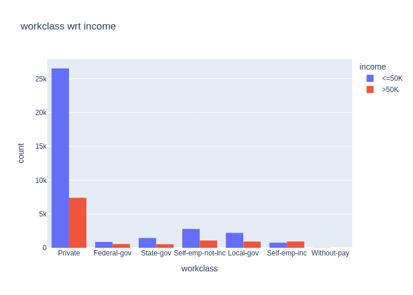
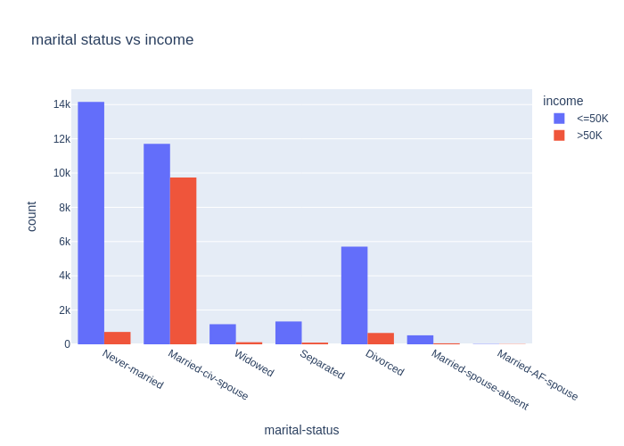

# Census Income Prediction

This project uses exploratory data analysis and classification models to predict whether a person earns more than $50K per year based on U.S. Census data.

The notebook includes visualizations built with Plotly, saved as static images to ensure full visibility on GitHub.

---

## Table of Contents

- [Overview](#overview)
- [Dataset](#dataset)
- [EDA (Exploratory Data Analysis)](#eda-exploratory-data-analysis)
- [Modeling](#modeling)
- [Results](#results)
- [How to Run](#how-to-run)
- [Visualizations](#visualizations)

---

## Overview

This project aims to classify individuals based on demographic features to predict whether their income exceeds $50K annually. It combines data preprocessing, visualization, and machine learning techniques to achieve the goal.

---

## Dataset

- **Source**: UCI Machine Learning Repository – Adult Census Income Dataset  
- **Features**: age, workclass, education, marital-status, occupation, relationship, race, sex, hours-per-week, etc.  
- **Target**: Income category (`<=50K` or `>50K`)

---

## EDA (Exploratory Data Analysis)

The project includes visual exploration of various features in relation to income distribution. All Plotly plots were saved as `.png` images and are included in the `plots/` folder for proper display on GitHub.

---

## Modeling

- Preprocessing: Label Encoding, One-Hot Encoding, Handling missing values
- Classifiers used:
  - Logistic Regression
  - Decision Tree
  - Random Forest
- Evaluation: Accuracy, Classification Report

---

## Results

- Best accuracy achieved: **0.85** (replace with your actual result)
- Most important features: `education`, `hours-per-week`, `marital-status`, etc.

---

## How to Run

1. Clone the repository:
   ```bash
   git clone https://github.com/shashivs96/census_income_prediction
.git
   ```
2. Open the notebook:
   - In Jupyter Notebook or Google Colab
3. Run all cells to explore EDA and model training

---

## Visualizations

Sample plots from the `plots/` folder:

  


> For full EDA, see the notebook.
